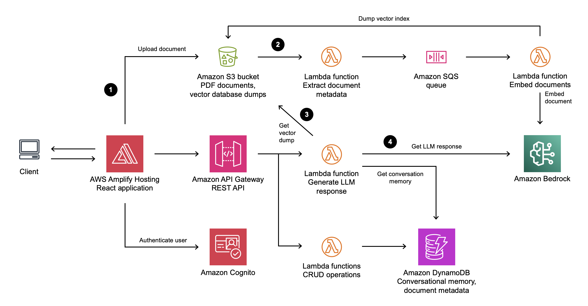

# Serverless document chat application

This sample application allows you to ask natural language questions of any PDF document you upload. It combines the text generation and analysis capabilities of an LLM with a vector search of the document content. The solution uses serverless services such as [Amazon Bedrock](https://aws.amazon.com/bedrock/) to access foundational models, [AWS Lambda](https://aws.amazon.com/lambda/) to run [LangChain](https://github.com/langchain-ai/langchain), and [Amazon DynamoDB](https://aws.amazon.com/dynamodb/) for conversational memory.

See the [accompanying blog post on the AWS Serverless Blog](https://aws.amazon.com/blogs/compute/building-a-serverless-document-chat-with-aws-lambda-and-amazon-bedrock/) for a detailed description and follow the deployment instructions below to get started.

<p float="left">
  
  
</p>

> **Warning**
> This application is not ready for production use. It was written for demonstration and educational purposes. Review the [Security](#security) section of this README and consult with your security team before deploying this stack. No warranty is implied in this example.

> **Note**
> This architecture creates resources that have costs associated with them. Please see the [AWS Pricing](https://aws.amazon.com/pricing/) page for details and make sure to understand the costs before deploying this stack.

## Key features

- [Amazon Bedrock](https://aws.amazon.com/de/bedrock/) for serverless embedding and inference
- [LangChain](https://github.com/hwchase17/langchain) to orchestrate a Q&A LLM chain
- [FAISS](https://github.com/facebookresearch/faiss) vector store
- [Amazon DynamoDB](https://aws.amazon.com/dynamodb/) for serverless conversational memory
- [AWS Lambda](https://aws.amazon.com/lambda/) for serverless compute
- Frontend built in [React](https://react.dev/), [TypeScript](https://www.typescriptlang.org/), [TailwindCSS](https://tailwindcss.com/), and [Vite](https://vitejs.dev/).
- Run locally or deploy to [AWS Amplify Hosting](https://aws.amazon.com/amplify/hosting/)
- [Amazon Cognito](https://aws.amazon.com/cognito/) for authentication

## How the application works



1. A user uploads a PDF document into an [Amazon Simple Storage Service](https://aws.amazon.com/s3/) (S3) bucket through a static web application frontend.
1. This upload triggers a metadata extraction and document embedding process. The process converts the text in the document into vectors. The vectors are loaded into a vector index and stored in S3 for later use.
1. When a user chats with a PDF document and sends a prompt to the backend, a Lambda function retrieves the index from S3 and searches for information related to the prompt.
1. A LLM then uses the results of this vector search, previous messages in the conversation, and its general-purpose capabilities to formulate a response to the user.

## Deployment instructions

### Prerequisites

- [AWS SAM CLI](https://docs.aws.amazon.com/serverless-application-model/latest/developerguide/install-sam-cli.html)
- [Python](https://www.python.org/) 3.11 or greater

### Cloning the repository

Clone this repository:

```bash
git clone https://github.com/aws-samples/serverless-pdf-chat.git
```

### Amazon Bedrock setup

This application can be used with a variety of Amazon Bedrock models. See [Supported models in Amazon Bedrock](https://docs.aws.amazon.com/bedrock/latest/userguide/what-is-service.html#models-supported) for a complete list.

By default, this application uses **Titan Embeddings G1 - Text** to generate embeddings and **Anthropic Claude v3 Sonnet** for responses.

> **Important -**
> Before you can use these models with this application, **you must request access in the Amazon Bedrock console**. See the [Model access](https://docs.aws.amazon.com/bedrock/latest/userguide/model-access.html) section of the Bedrock User Guide for detailed instructions.
> By default, this application is configured to use Amazon Bedrock in the `us-east-1` Region, make sure you request model access in that Region (this does not have to be the same Region that you deploy this stack to).

To select your Bedrock model, specify the `ModelId` parameter during the AWS SAM deployment, such as `anthropic.claude-3-sonnet-20240229-v1:0`. See [Amazon Bedrock model IDs](https://docs.aws.amazon.com/bedrock/latest/userguide/model-ids.html) for a complete list.

The `ModelId` parameter is used in the GenerateResponseFunction Lambda function of your AWS SAM template to instantiate [LangChain BedrockChat](https://js.langchain.com/v0.1/docs/integrations/chat/bedrock/) and [ConversationalRetrievalChain](https://api.python.langchain.com/en/latest/chains/langchain.chains.conversational_retrieval.base.ConversationalRetrievalChain.html) objects, providing efficient retrieval of relevant context from large PDF datasets to enable the Bedrock model-generated response.

```python
def bedrock_chain(faiss_index, memory, human_input, bedrock_runtime):

    chat = BedrockChat(
        model_id=MODEL_ID,
        model_kwargs={'temperature': 0.0}
    )

    chain = ConversationalRetrievalChain.from_llm(
        llm=chat,
        chain_type="stuff",
        retriever=faiss_index.as_retriever(),
        memory=memory,
        return_source_documents=True,
    )

    response = chain.invoke({"question": human_input})

    return response
```

### Deploy the frontend with AWS Amplify Hosting

[AWS Amplify Hosting](https://aws.amazon.com/amplify/hosting/) enables a fully-managed deployment of the application's React frontend in an AWS-managed account using Amazon S3 and [Amazon CloudFront](https://docs.aws.amazon.com/AmazonCloudFront/latest/DeveloperGuide/Introduction.html). You can optionally run the React frontend locally by skipping to [Deploy the application with AWS SAM](#Deploy-the-application-with-AWS-SAM).

To set up Amplify Hosting:

1. Fork this GitHub repository and take note of your repository URL, for example `https://github.com/user/serverless-pdf-chat/`.
1. Create a GitHub fine-grained access token for the new repository by following [this guide](https://docs.aws.amazon.com/amplify/latest/userguide/setting-up-GitHub-access.html). For the **Repository permissions**, select **Read and write** for **Content** and **Webhooks**.
1. Create a new secret called `serverless-pdf-chat-github-token` in AWS Secrets Manager and input your fine-grained access token as plaintext. Select the **Plaintext** tab and confirm your secret looks like this:

   ```json
   github_pat_T2wyo------------------------------------------------------------------------rs0Pp
   ```

### Deploy the application with AWS SAM

1. Change to the `backend` directory and [build](https://docs.aws.amazon.com/serverless-application-model/latest/developerguide/sam-cli-command-reference-sam-build.html) the application:

   ```bash
   cd backend
   sam build
   ```

1. [Deploy](https://docs.aws.amazon.com/serverless-application-model/latest/developerguide/sam-cli-command-reference-sam-deploy.html) the application into your AWS account:

   ```bash
   sam deploy --guided
   ```

1. For **Stack Name**, choose `serverless-pdf-chat`.

1. For **Frontend**, specify the environment ("local", "amplify") for the frontend of the application.

1. If you selected "amplify", specify the URL of the forked Git repository containing the application code.

1. Specify the Amazon Bedrock model ID. For example, `anthropic.claude-3-sonnet-20240229-v1:0`.

1. For the remaining options, keep the defaults by pressing the enter key.

AWS SAM will now provision the AWS resources defined in the `backend/template.yaml` template. Once the deployment is completed successfully, you will see a set of output values similar to the following:

```bash
CloudFormation outputs from deployed stack
-------------------------------------------------------------------------------
Outputs
-------------------------------------------------------------------------------
Key                 CognitoUserPool
Description         -
Value               us-east-1_gxKtRocFs

Key                 CognitoUserPoolClient
Description         -
Value               874ghcej99f8iuo0lgdpbrmi76k

Key                 ApiGatewayBaseUrl
Description         -
Value               https://abcd1234.execute-api.us-east-1.amazonaws.com/dev/
-------------------------------------------------------------------------------
```

If you selected to deploy the React frontend using Amplify Hosting, navigate to the Amplify console to check the build status. If the build does not start automatically, trigger it through the Amplify console.

If you selected to run the React frontend locally and connect to the deployed resources in AWS, you will use the CloudFormation stack outputs in the following section.

### Optional: Run the React frontend locally

Create a file named `.env.development` in the `frontend` directory. [Vite will use this file](https://vitejs.dev/guide/env-and-mode.html) to set up environment variables when we run the application locally.

Copy the following file content and replace the values with the outputs provided by AWS SAM:

```plaintext
VITE_REGION=us-east-1
VITE_API_ENDPOINT=https://abcd1234.execute-api.us-east-1.amazonaws.com/dev/
VITE_USER_POOL_ID=us-east-1_gxKtRocFs
VITE_USER_POOL_CLIENT_ID=874ghcej99f8iuo0lgdpbrmi76k
```

Next, install the frontend's dependencies by running the following command in the `frontend` directory:

```bash
npm ci
```

Finally, to start the application locally, run the following command in the `frontend` directory:

```bash
npm run dev
```

Vite will now start the application under `http://localhost:5173`.

### Create a user in the Amazon Cognito user pool

The application uses Amazon Cognito to authenticate users through a login screen. In this step, you will create a user to access the application.

Perform the following steps to create a user in the Cognito user pool:

1. Navigate to the **Amazon Cognito console**.
1. Find the user pool with an ID matching the output provided by AWS SAM above.
1. Under Users, choose **Create user**.
1. Enter an email address and a password that adheres to the password requirements.
1. Choose **Create user**.

Navigate back to your Amplify website URL or local host address to log in with the new user's credentials.

## Cleanup

1. Delete any secrets in AWS Secrets Manager created as part of this walkthrough.
1. [Empty the Amazon S3 bucket](https://docs.aws.amazon.com/AmazonS3/latest/userguide/empty-bucket.html) created as part of the AWS SAM template.
1. Run the following command in the `backend` directory of the project to delete all associated resources resources:

   ```bash
   sam delete
   ```
## Troubleshooting

If you are experiencing issues when running the [`sam build`](https://docs.aws.amazon.com/serverless-application-model/latest/developerguide/sam-cli-command-reference-sam-build.html) command, try setting the `--use-container` flag (requires Docker):

```bash
sam build --use-container
```

If you are still experiencing issues despite using `--use-container`, try switching the AWS Lambda functions from `arm64` to `x86_64` in the `backend/template.yaml` (as well as switching to the `x_86_64` version of Powertools):

```yaml
Globals:
  Function:
    Runtime: python3.11
    Handler: main.lambda_handler
    Architectures:
      - x86_64
    Tracing: Active
    Environment:
      Variables:
        LOG_LEVEL: INFO
    Layers:
      - !Sub arn:aws:lambda:${AWS::Region}:017000801446:layer:AWSLambdaPowertoolsPythonV2:51
```

## Security

This application was written for demonstration and educational purposes and not for production use. The [Security Pillar of the AWS Well-Architected Framework](https://docs.aws.amazon.com/wellarchitected/latest/security-pillar/welcome.html) can support you in further adopting the sample into a production deployment in addition to your own established processes. Take note of the following:

- The application uses encryption in transit and at rest with AWS-managed keys where applicable. Optionally, use [AWS KMS](https://aws.amazon.com/kms/) with [DynamoDB](https://docs.aws.amazon.com/kms/latest/developerguide/services-dynamodb.html), [SQS](https://docs.aws.amazon.com/AWSSimpleQueueService/latest/SQSDeveloperGuide/sqs-server-side-encryption.html), and [S3](https://docs.aws.amazon.com/kms/latest/developerguide/services-s3.html) for more control over encryption keys.

- This application uses [Powertools for AWS Lambda (Python)](https://github.com/aws-powertools/powertools-lambda-python) to log to inputs and ouputs to CloudWatch Logs. Per default, this can include sensitive data contained in user input. Adjust the log level and remove log statements to fit your security requirements.

- [API Gateway access logging](https://docs.aws.amazon.com/apigateway/latest/developerguide/set-up-logging.html#set-up-access-logging-using-console) and [usage plans](https://docs.aws.amazon.com/apigateway/latest/developerguide/api-gateway-api-usage-plans.html) are not activiated in this code sample. Similarly, [S3 access logging](https://docs.aws.amazon.com/AWSCloudFormation/latest/UserGuide/aws-properties-s3-bucket-loggingconfig.html) is currently not enabled.

- In order to simplify the setup of the demo, this solution uses AWS managed policies associated to IAM roles that contain wildcards on resources. Please consider to further scope down the policies as you see fit according to your needs. Please note that there is a resource wildcard on the AWS managed `AWSLambdaSQSQueueExecutionRole`. This is a known behaviour, see [this GitHub issue](https://github.com/aws/serverless-application-model/issues/2118) for details.

- If your security controls require inspecting network traffic, consider [adjusting the AWS SAM template](https://docs.aws.amazon.com/serverless-application-model/latest/developerguide/sam-resource-function.html) to attach the Lambda functions to a VPC via its [`VpcConfig`](https://docs.aws.amazon.com/AWSCloudFormation/latest/UserGuide/aws-properties-lambda-function-vpcconfig.html).

See [CONTRIBUTING](CONTRIBUTING.md#security-issue-notifications) for more information.

## License

This library is licensed under the MIT-0 License. See the [LICENSE](LICENSE) file.
